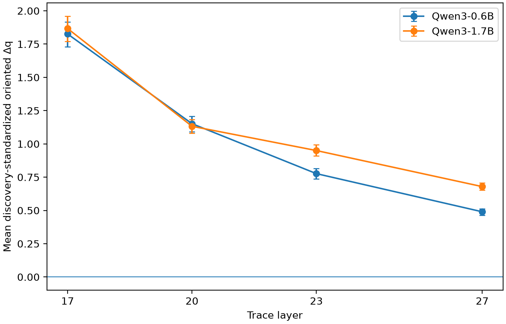
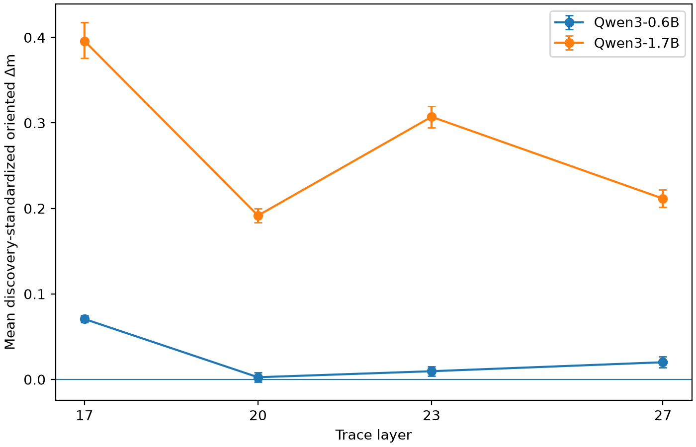
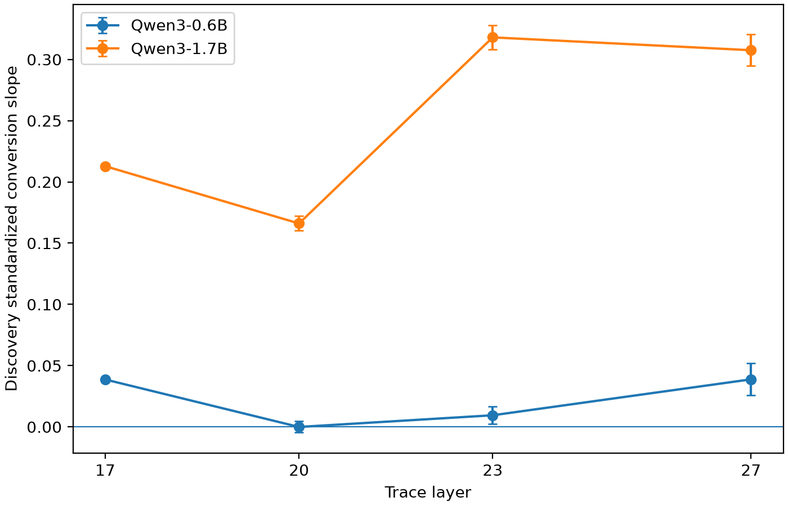
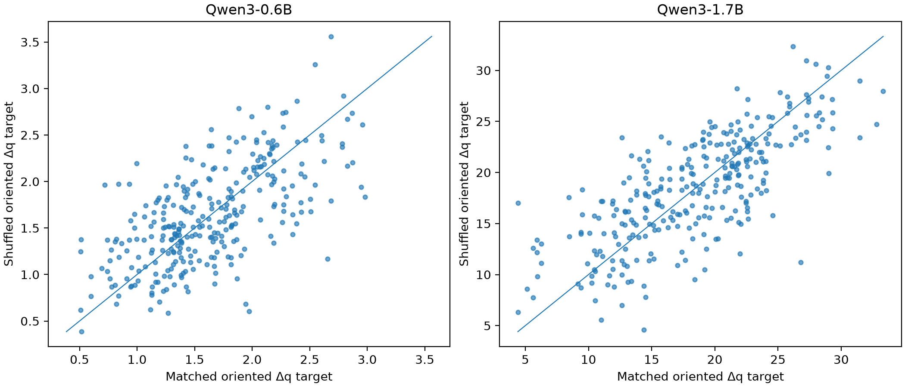
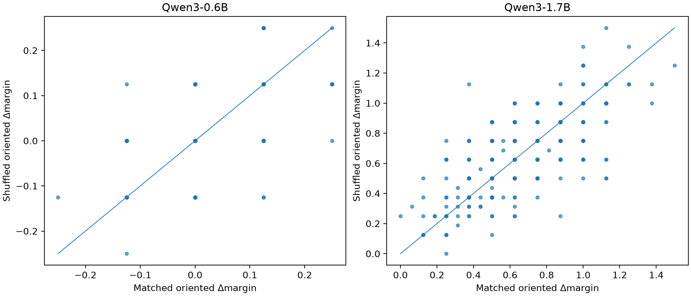
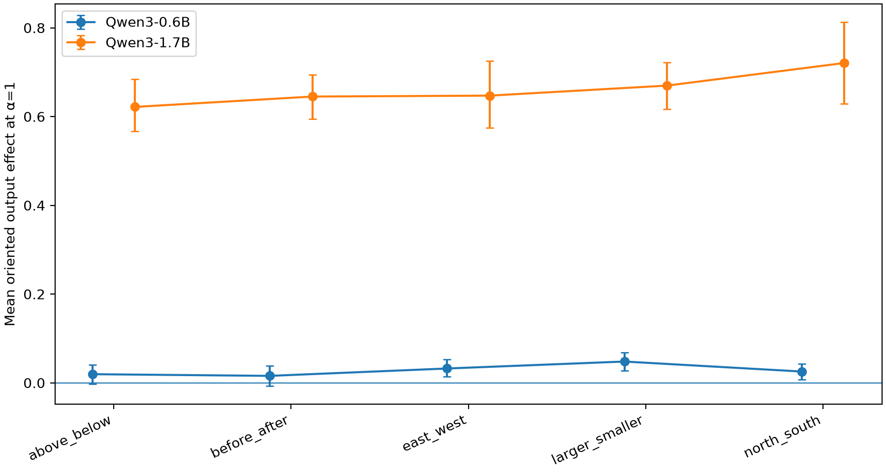

# E01A Trace Mechanism Analysis

Status date: 2026-08-27. This is post hoc exploratory analysis of completed
E01A discovery evidence. **Confirmation remained locked and was not loaded.**

## 1. Question

Where does the Qwen3-0.6B to Qwen3-1.7B causal-conversion difference arise?
The analysis separates propagation of the injected probe coordinate through
later layers from conversion of that surviving perturbation into the native
Yes-minus-No readout. It also tests whether the matched/shuffled equivalence is
accounted for by the scalar coordinate target that is the only source-derived
quantity available to these rank-one treatments.

## 2. Data provenance

Only these immutable full-discovery runs were read:

| Model | Run | Directed examples | Pair clusters | Trace layers |
|---|---|---:|---:|---|
| Qwen3-0.6B | `runs/E01A/E01A_c6cd215d7bf8` | 300 | 150 | 17, 20, 23, 27 |
| Qwen3-1.7B | `runs/E01A/E01A_821138e998c7` | 300 | 150 | 17, 20, 23, 27 |

Both runs are complete and contain the predeclared alpha grid `[-1, -0.5, 0,
0.25, 0.5, 1, 1.5, 2]`. The analysis used only
`intervention_rows.parquet`, `trace_rows.parquet`, and existing run metadata.
No model was loaded and no new forward pass was run. The full alpha sweep is
retained in `analysis/E01A_TRACE_MECHANISM/trace_layer_metrics.parquet`; the
primary tables below are the predeclared `truth_coordinate`, `alpha=1` view.

All confidence intervals use 2,000 deterministic percentile-bootstrap draws
that resample `pair_id` clusters. Standardized quantities divide each trace
change by the discovery SD of the corresponding deduplicated clean trace at
that model and layer. They are labeled **discovery-standardized** and are not
confirmatory normalized effects.

## 3. No-confirmation statement

Both source runs record `confirmation_accessed=false`. The analysis did not
load confirmation rows, labels, metrics, caches, or artifacts. Confirmation
was not used for standardization, mechanism classification, or the E01B
proposal.

## 4. Integrity checks

The repeated clean trace values were grouped by model, base sample, and trace
layer across condition, alpha, and direction seed. The maximum disagreement
was exactly `0` for both `clean_truth_coordinate` and
`clean_native_yes_no_margin` in both models. Deduplication produced 1,200
unique base-by-layer rows per model. Expected counterfactual label, pair,
relation family, gold label, and clean prediction were each invariant within
base sample before the many-to-one orientation merge.

Positive oriented changes mean movement toward the expected counterfactual
class for both Yes and No targets. For target Yes the sign is `+1`; for target
No it is `-1`.

## 5. Truth-signal propagation

| Model | Layer | Mean raw oriented Δq | Mean Δq_z (95% CI) | Median Δq_z | Correct-sign fraction | Retention (95% CI) |
|---|---:|---:|---:|---:|---:|---:|
| 0.6B | 17 | 1.6303 | 1.8260 [1.7290, 1.9163] | 1.7595 | 1.000 | 1.000 [1.000, 1.000] |
| 0.6B | 20 | 1.4348 | 1.1519 [1.0925, 1.2075] | 1.1095 | 1.000 | 0.631 [0.628, 0.633] |
| 0.6B | 23 | 1.5585 | 0.7765 [0.7373, 0.8140] | 0.7537 | 1.000 | 0.425 [0.421, 0.429] |
| 0.6B | 27 | 1.8201 | 0.4898 [0.4643, 0.5130] | 0.4842 | 1.000 | 0.268 [0.264, 0.272] |
| 1.7B | 17 | 18.4487 | 1.8670 [1.7704, 1.9608] | 1.9270 | 1.000 | 1.000 [1.000, 1.000] |
| 1.7B | 20 | 23.0733 | 1.1324 [1.0805, 1.1828] | 1.1611 | 1.000 | 0.607 [0.603, 0.610] |
| 1.7B | 23 | 38.7677 | 0.9500 [0.9086, 0.9927] | 0.9849 | 1.000 | 0.509 [0.504, 0.514] |
| 1.7B | 27 | 59.0205 | 0.6789 [0.6519, 0.7057] | 0.6847 | 1.000 | 0.364 [0.358, 0.370] |

The standardized perturbations are indistinguishable at L17 and L20 in the
independent model bootstrap. At L23 and L27, 1.7B retains more standardized
signal: the 1.7B-minus-0.6B mean differences are `0.1735 [0.1174, 0.2314]`
and `0.1892 [0.1533, 0.2255]`. Thus 0.6B shows a late propagation disadvantage,
not an immediate injection deficit.

Across examples, L17-to-downstream Δq_z remains highly correlated. Pearson /
Spearman correlations are `0.995/0.994`, `0.973/0.972`, and `0.931/0.934` at
L20/L23/L27 for 0.6B, versus `0.984/0.979`, `0.965/0.958`, and `0.883/0.876`
for 1.7B. The mean signal attenuates even though example rank is largely
preserved, so retention ratios are not being interpreted alone.

## 6. Native-readout conversion through depth

| Model | Layer | Mean raw oriented Δmargin | Mean Δm_z (95% CI) | Pearson / Spearman corr(Δq_z, Δm_z) | No-intercept beta (95% CI) | Uncentered R² |
|---|---:|---:|---:|---:|---:|---:|
| 0.6B | 17 | 0.0785 | 0.0707 [0.0665, 0.0748] | 0.777 / 0.747 | 0.0387 [0.0375, 0.0398] | 0.943 |
| 0.6B | 20 | 0.0026 | 0.0025 [-0.0031, 0.0080] | -0.169 / -0.164 | -0.0001 [-0.0046, 0.0046] | 0.000 |
| 0.6B | 23 | 0.0138 | 0.0096 [0.0042, 0.0148] | -0.108 / -0.104 | 0.0095 [0.0025, 0.0164] | 0.029 |
| 0.6B | 27 | 0.0283 | 0.0201 [0.0139, 0.0269] | 0.046 / 0.048 | 0.0388 [0.0260, 0.0520] | 0.096 |
| 1.7B | 17 | 0.6808 | 0.3958 [0.3761, 0.4179] | 0.962 / 0.962 | 0.2128 [0.2109, 0.2149] | 0.992 |
| 1.7B | 20 | 0.4713 | 0.1917 [0.1834, 0.1999] | 0.566 / 0.541 | 0.1661 [0.1603, 0.1723] | 0.905 |
| 1.7B | 23 | 2.2194 | 0.3071 [0.2945, 0.3194] | 0.696 / 0.665 | 0.3180 [0.3082, 0.3281] | 0.951 |
| 1.7B | 27 | 0.6623 | 0.2115 [0.2017, 0.2218] | 0.534 / 0.513 | 0.3075 [0.2947, 0.3206] | 0.893 |

At every layer the 1.7B standardized native-margin response and discovery
standardized conversion slope are much larger. The independent-bootstrap
1.7B-minus-0.6B slope differences are `0.1742 [0.1719, 0.1765]` at L17,
`0.1661 [0.1587, 0.1741]` at L20, `0.3085 [0.2962, 0.3208]` at L23, and
`0.2687 [0.2499, 0.2875]` at L27.

The intercept-included sensitivity slopes for 0.6B are `0.0381`, `-0.0227`,
`-0.0194`, and `0.0177`; at weak intermediate effects this changes the slope's
sign and confirms that the no-intercept beta should not be treated as an
intrinsic constant. The 1.7B sensitivity slopes remain positive (`0.2213`,
`0.1288`, `0.2504`, `0.2538`). Both the direct Δm_z means and the sensitivity
fit preserve the much stronger 1.7B conversion conclusion.

## 7. Cross-scale comparison

Differences below are 1.7B minus 0.6B, using independent pair-cluster
resampling within each model.

| Layer | Δq_z difference (95% CI) | Δm_z difference (95% CI) | Beta difference (95% CI) |
|---:|---:|---:|---:|
| 17 | 0.0410 [-0.0876, 0.1763] | 0.3251 [0.3052, 0.3475] | 0.1742 [0.1719, 0.1765] |
| 20 | -0.0195 [-0.0945, 0.0566] | 0.1891 [0.1796, 0.1987] | 0.1661 [0.1587, 0.1741] |
| 23 | 0.1735 [0.1174, 0.2314] | 0.2976 [0.2839, 0.3112] | 0.3085 [0.2962, 0.3208] |
| 27 | 0.1892 [0.1533, 0.2255] | 0.1914 [0.1791, 0.2035] | 0.2687 [0.2499, 0.2875] |

Sample IDs are identical across models. An additional paired-semantic-example
sensitivity analysis gives the same Δq_z/Δm_z conclusions; it is saved in
`cross_scale_metrics.json`. The independent analysis remains primary because
the checkpoint outputs are not paired stochastic observations.

## 8. Matched versus shuffled explanation

At alpha 1, matched and shuffled target coordinates are strongly correlated:
Pearson `r=0.873` in 0.6B and `r=0.918` in 1.7B. Their oriented target
displacements correlate at `r=0.638` and `r=0.742`; their output effects
correlate at `r=0.545` and `r=0.706`. Median absolute matched/shuffled target
coordinate differences are `0.301` and `2.689` raw coordinate units,
respectively, while the corresponding median absolute displacement
differences are `0.296` and `2.682`.

Across the union of matched and shuffled coordinate treatments at every
non-zero alpha, coordinate displacement is highly collinear with alpha
(`r=0.938` and `0.947`). Alpha was therefore dropped from the predeclared
reduced regression. Pair-cluster bootstrap results are:

| Model | Coordinate coefficient (95% CI) | Matched-source indicator (95% CI) | R² |
|---|---:|---:|---:|
| 0.6B | 0.01627 [0.01381, 0.01883] | 0.00054 [-0.00289, 0.00401] | 0.086 |
| 1.7B | 0.03428 [0.03276, 0.03597] | 0.00048 [-0.00591, 0.00666] | 0.828 |

There is no detected residual matched-source effect once actual scalar
coordinate displacement is included. This is strong operational support for
the implementation-level explanation: these coordinate-only conditions
discard every source property except the scalar target, and the sampled scalar
targets are similar. The scalar regression explains 1.7B effects well but only
8.6% of 0.6B effect variance, so a null matched indicator is not proof that the
coordinate fully explains small-model response variability, nor that source
identity could never matter if orthogonal context were allowed to enter.

## 9. Relation-family analysis

| Family | 0.6B effect (95% CI) | 1.7B effect (95% CI) | 0.6B L17 Δq_z | 1.7B L17 Δq_z | 0.6B L27 Δm_z | 1.7B L27 Δm_z |
|---|---:|---:|---:|---:|---:|---:|
| above_below | 0.0194 [-0.0022, 0.0409] | 0.6218 [0.5668, 0.6843] | 2.088 | 1.967 | 0.0138 | 0.1975 |
| before_after | 0.0156 [-0.0067, 0.0379] | 0.6451 [0.5949, 0.6942] | 1.532 | 1.927 | 0.0111 | 0.2074 |
| east_west | 0.0323 [0.0141, 0.0524] | 0.6472 [0.5745, 0.7258] | 1.549 | 1.454 | 0.0229 | 0.2086 |
| larger_smaller | 0.0479 [0.0271, 0.0688] | 0.6698 [0.6166, 0.7219] | 2.449 | 2.533 | 0.0340 | 0.2152 |
| north_south | 0.0254 [0.0078, 0.0430] | 0.7207 [0.6289, 0.8125] | 1.529 | 1.499 | 0.0180 | 0.2270 |

No relation family reverses the point-estimate sign or dominates the
cross-scale result. Two small-model family intervals include zero, consistent
with the overall sparse 0.6B response; families were neither selected nor
dropped.

## 10. Behavioral-error stratification

The required clean fields are present, so no behavior was regenerated.

| Model | Base prediction | n | Mean oriented alpha-1 effect (95% CI) |
|---|---|---:|---:|
| 0.6B | incorrect | 118 | 0.0318 [0.0171, 0.0459] |
| 0.6B | correct | 182 | 0.0261 [0.0133, 0.0379] |
| 1.7B | incorrect | 138 | 0.7418 [0.7020, 0.7871] |
| 1.7B | correct | 162 | 0.5941 [0.5505, 0.6384] |

The coordinate remains causally actionable in the native-error stratum in
both models. This is not an error-correction claim: the E01A intervention is
oriented toward the counterfactual (opposite-gold) label, so an initially
incorrect base can already predict that target.

## 11. Mechanism classification

**C. Mixed bottleneck, with readout conversion as the dominant component.**

The injected standardized coordinate is comparable at L17/L20, while 1.7B
shows substantially larger Δm_z and conversion slopes from L17 onward. This is
the primary difference. A second, later difference appears because 1.7B
retains more Δq_z at L23/L27. The evidence therefore rejects a pure immediate
propagation bottleneck and does not support a propagation-only explanation.

## 12. Implications for E01B

E01B should be split into two frozen, complementary discovery designs. It
remains `proposed_not_authorized`.

### E01B-1: source-free coordinate setpoints

Estimate class-coordinate targets exclusively from a predeclared
non-confirmation development split, using either class medians or predeclared
standardized coordinate levels. At the frozen site, set
`h' = h + (q_target - q_base)u`. Cross the same base examples with identical
target levels so source identity is absent by construction. Freeze target
estimation, setpoint grid, site, probe, and metrics before discovery
evaluation.

### E01B-2: orthogonal-context modulation

Decompose a source difference as
`h_source - h_base = Δq u + P_perp_u(h_source - h_base)`. Hold `Δq` fixed and
vary the orthogonal component among: none, matched-twin context, same-family
shuffled context, different-family shuffled context, and norm-matched random
orthogonal context. Match orthogonal norms per example, preserve the explicit
no-intervention and coordinate-only references, and predeclare pair-cluster
contrasts. This gives source/nuisance context an actual route to affect the
model, unlike E01A's coordinate-only matched/shuffled conditions.

## 13. Claim boundaries

- These are post hoc exploratory discovery results, not confirmation.
- Discovery standardization is descriptive and model/layer specific.
- Conversion beta depends on the tested intervention distribution and is not
  an intrinsic causal constant.
- The mixed classification localizes the measured intervention pathway; it
  does not prove how the unperturbed model endogenously computes answers.
- The null matched indicator applies only to E01A's coordinate-only treatment.
- No conclusion is generalized beyond these checkpoints, task, site, and
  candidate readout.
